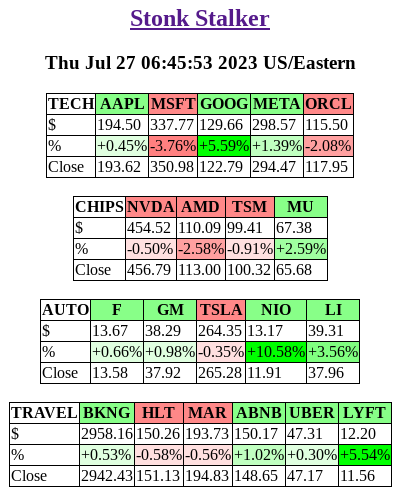

# Stonk Stalker
A simple dashboard to stalk your stocks, circa 1997

## ScreenShot


## Get the image from Docker Hub or build it locally
```
docker pull fullaxx/stonk_stalker
docker build -t="fullaxx/stonk_stalker" github.com/Fullaxx/stonk_stalker
```

## Stalk with extra info
Links to other info: OTHER_URLS=1 \
Market Cap info: DISPLAY_MARKET_CAP=1 \
Forward PE Ratio: DISPLAY_FPE_RATIO=1
```
docker run -d --rm -e OTHER_URLS=1 -e DISPLAY_MARKET_CAP=1 -e TICKER_TABLES="TECH=AAPL,MSFT,GOOG;CHIPS=NVDA,AMD,TSM;AUTO=F,GM,TSLA" -p 80:80 fullaxx/stonk_stalker
docker run -d --rm -e OTHER_URLS=1 -e DISPLAY_FPE_RATIO=1  -e TICKER_TABLES="TECH=AAPL,MSFT,GOOG;CHIPS=NVDA,AMD,TSM;AUTO=F,GM,TSLA" -p 80:80 fullaxx/stonk_stalker
```

## Stalk with dark mode enabled
DARK MODE IS NOT FUNCTIONAL YET (need to adjust table cell colors to fit dark mode)
```
docker run -d --rm -e DARKMODE=1 -e TICKER_TABLES="TECH=AAPL,MSFT,GOOG;CHIPS=NVDA,AMD,TSM;AUTO=F,GM,TSLA" -p 80:80 fullaxx/stonk_stalker
```

## Stalk whatever you want
TICKER_TABLES is the env variable that will control the layout of the tables. \
TICKER_TABLES is a semi-colon delimited list of tables. \
Each table includes a name and a list of symbols. \
4 Tables listed in this example: \
TECH=AAPL,MSFT,GOOG,META,ORCL \
CHIPS=NVDA,AMD,TSM,MU \
AUTO=F,GM,TSLA,NIO,LI \
TRAVEL=BKNG,HLT,MAR,ABNB,UBER,LYFT
```
docker run -d --rm -e TICKER_TABLES="TECH=AAPL,MSFT,GOOG,META,ORCL;CHIPS=NVDA,AMD,TSM,MU;AUTO=F,GM,TSLA,NIO,LI;TRAVEL=BKNG,HLT,MAR,ABNB,UBER,LYFT" -p 80:80 fullaxx/stonk_stalker
```

## Set the JSON refresh interval
Default: 1000ms
```
docker run -d --rm -e JSON_UPDATE=5000 -e TICKER_TABLES="TECH=AAPL,MSFT,GOOG;CHIPS=NVDA,AMD,TSM;AUTO=F,GM,TSLA" -p 80:80 fullaxx/stonk_stalker
```
